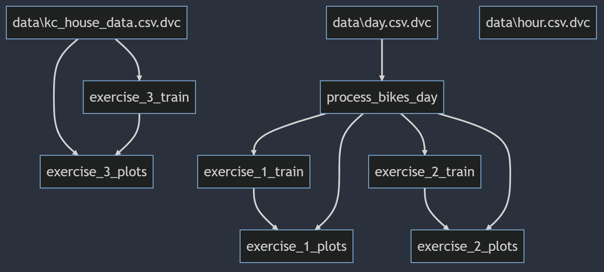
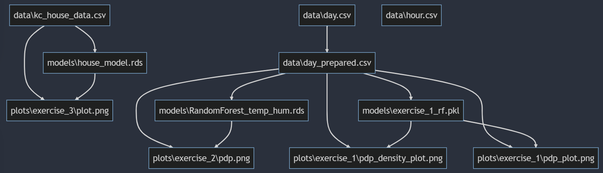

# EDM - lab - Deployment

## Report

Report for the lab is available [**here**](doc/report.pdf).

## Git/GitHub

The development workflow for the lab is based on the [GitHub Flow](https://docs.github.com/en/get-started/quickstart/github-flow) model which consists of the following steps:

1. Break the work into a list of tasks.
2. Create an issue for each task.
3. Create a branch for each issue and commit to it as you work on the task.
4. When you finish the task, create a pull request.
5. Merge the pull request after the code has been reviewed and tested.
6. Delete the branch associated with the pull request.

However we decided to restore all the deleted branches for the sake of the lab. Note that it is not a good practice to keep the branches after they have been merged as it can lead to confusion and clutter of the repository.

- All the issues can be seen [**here**](https://github.com/steciuk/EDM-lab-5/issues?q=is%3Aissue).
- All the pull requests can be seen [**here**](https://github.com/steciuk/EDM-lab-5/pulls?q=is%3Apr).
- All the branches can be seen [**here**](https://github.com/steciuk/EDM-lab-5/branches).

## DVC

The DVC pipeline specification can be inspected [**here**](dvc.yaml).

Visualization of the pipeline stages and their dependencies:

Visualization of the pipeline outputs and their relationships:

